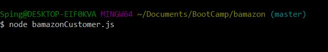
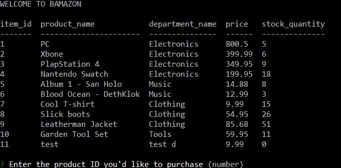
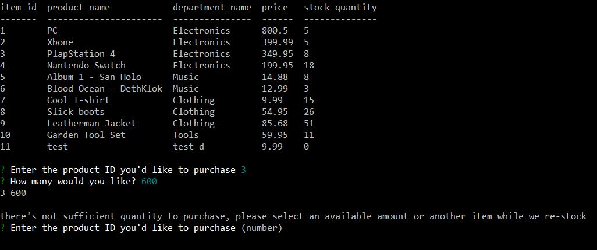
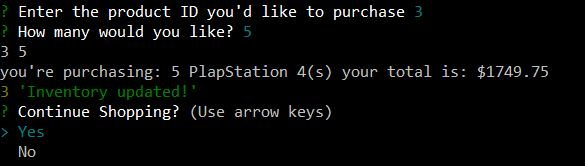

# bamazon

*What's Bamazon?*

## node.JS sever that integrates mySQL database for purchasing products through the command line.

Sounds interesting? Well keep reading to install!

## Getting her up and running

First start by cloning the project into your local machine. Included in the files is the schema for the SQL database to help you get up and running. This project has some dependencies that can be attained by simply running npm install in the project folder. I've hidden that database connection password with dotenv so don't forget to create a .env file and give it your key.

## Okay I'm ready now, where's the shopping fun!?

### Customer mode!
Start by running *node bamazonCustomer.js* if you did so correctly it will display this:

See the table with all the items? It asks you to then select the "product" ID of the item you'd like to purchase. Go ahead, type a number and press enter you'll see the image below:

As you can see the image above is asking how many you'd like to purchase, this performs some validation to make sure there's enough to purchase before actually updating the database, if you try to buy 600 Plapstation 4's it's really not gonna let you, like so:

If you select a valid amount it'll tell you what you bought, how many and how much money you really shouldn't be spending! See below:

It then asks you if you'd like to continue shopping! You can select yes or no if you select no you end your session!

### Manager mode!

Alright, so you made it through and bought stuff, but then you realize, "wait I work here too", well its time to check the inventory and restock! Welcome to manager mode.

To start type *node bamazonManager*
